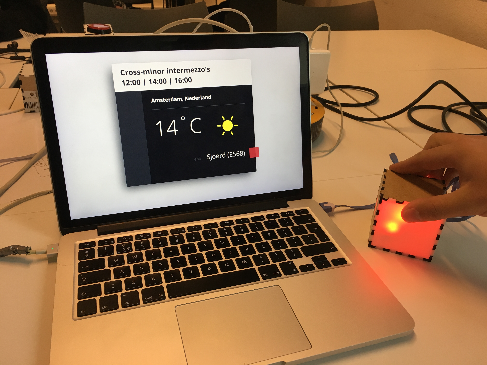

<h1 align="center">
  
   
   
  minor-wot-weather
</h1>

## Concept
The _cross-minor intermezzo_ brings together students outside every now and then for a much needed break. Consistantly going at it for too long without a break may lead to nearsightedness or other health concerns.
But changing wheather can leave the students in doubt whether to participate or not. Using a arduino setup in a box connected to a server, a message will be send to the boxes of the students so they no longer have to wonder if the intermezzo will commence.

## How it works
**1. Express server**

The server request the current weather from [Darksky](https://darksky.net/dev/) and shows it in the view. Darksky also sends the current weather in words, something like 'rain' or 'clear-day'. Based on each response, the view will have a different animation. The current temperature will also be shown. The start of each intermezzo is fixed and automated, when it is time the server sends a message to all connected users.

**2. Arduino**

Every user will have a box containing a LED strip, a NodeMCU, and a tilt sensor. When the box recieves the intermezzo signal, the LED inside the box will give an indication of the weather and the LED tower shows the number of participants. Using the tilt sensor the user can make a choice whether to participate or not by flipping the box to one side or another.

**3. API**

The API picks up any button presses and will send a response to all the connected devices which will turn on the LED. The color of the LED depends on the current weather, blue means colder, red means warmer, flickering blue means rain.

## Team

 |  |  |
---|---|---
[Luuk Hafkamp](https://github.com/lhafkamp) | [Sjoerd Beentjes](https://github.com/Sjoerdbeentjes) | [Merlijn Vos](https://github.com/Murderlon) |
