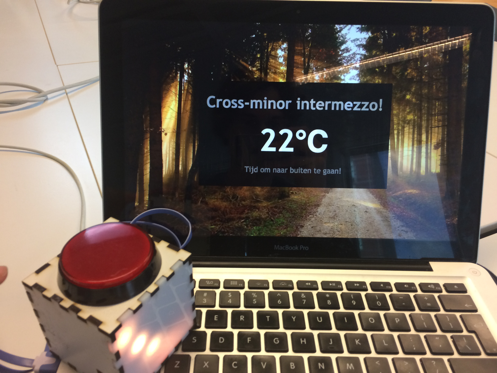

<h1 align="center">
  
   
   
  minor-wot-weather
</h1>

## Concept
The _cross-minor intermezzo_ brings together students outside every now and then for a much needed break. Consistantly going at it for too long without a break may lead to nearsightedness or other health concerns.
But changing wheather can leave the students in doubt whether to participate or not. Using a arduino setup with a server, students will no longer have to wonder if the intermezzo will commence.

## How it works
1. Express server
The server request the current temperture from [Wunderground](https://api.wunderground.com) and shows it in the view. If the the temperture is below 18 degrees celcius the view will have a rainy theme, if above, it will look sunny.

2. Arduino
The Arduino setup consists of a box made of a led strip, an Arduino with WiFi, and a button. The Arduino is configured with the express server and API.

3. API
The API picks up any button presses and will send a response to all the connected devices which will turn on the LED. The color of the LED depends on the current weather, blue means colder, red means warmer.

## Flowchart
To be continued...

## Team

 |  |  |
---|---|---
[Luuk Hafkamp](https://github.com/lhafkamp) | [Sjoerd Beentjes](https://github.com/Sjoerdbeentjes) | [Merlijn Vos](https://github.com/Murderlon) |
